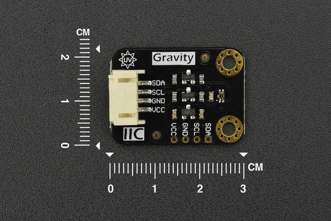

# DFRobot_VEML6075

- [中文版](./README_CN.md)

  The VEML6075 senses UVA and UVB light and incorporates
photodiode, amplifiers, and analog / digital circuits into a
single chip using a CMOS process. When the UV sensor is
applied, it is able to detect UVA and UVB intensity to provide
a measure of the signal strength as well as allow for UVI
measurement. </br>

  The VEML6075 provides excellent temperature compensation
capability for keeping the output stable under changing
temperature. VEML6075’s functionality is easily operated via
the simple command format of I2C (SMBus compatible)
interface protocol. VEML6075’s operating voltage ranges
from 1.7 V to 3.6 V. VEML6075 is packaged in a lead (Pb)-free
4 pin OPLGA package which offers the best market-proven
reliability. <br>



## Product Link(https://www.dfrobot.com/product-1906.html)

    SKU：SEN0303

## Table of Contents
* [Summary](#summary)
* [Installation](#installation)
* [Methods](#methods)
* [Compatibility](#compatibility)
* [History](#history)
* [Credits](#credits)

## Summary

1. Get UVA, UVB and UVI with data from VEML6075.<br>
2. These data are printed out through the serial port.<br>
3. Use API to config module.<br>
## Installation

Before use, first download the library file, paste it into your Raspberry Pi's custom directory, then open the examples folder and run the demo in that folder.

## Methods

```python
  def begin(self):
    '''!
      @brief initialization function
      @return bool,returns the initialization status
      @retval True Initialization succeeded
      @retval False Initialization  failed
    '''

  def _write_reg(self, reg, val):
    '''!
      @brief write the sensor IIC data
      @param reg register
      @param val write the store and buffer of the data
      @return return the actually written length
    '''

  def _read_reg(self, reg, len):
    '''!
      @brief get the sensor IIC data
      @param reg register
      @param len data length to be readed 
      @return return the actually readed length
    '''

  def _write_reg_bits(self, reg, field, val):
    '''!
      @brief Sets bits of a register
      @param reg register
      @param field field
      @param val Value to be set
    '''

  def set_power(self, power):
    '''!
      @brief Set power
      @param power Power status to set
    '''

  def uvi2mwpcm2(self, Uvi):
    '''!
      @brief Data conversion
      @return mW/cm2
    '''

  def get_power(self):
    '''!
      @brief get power status
      @return  Power status
      @retval    1    power on
      @retval    0   power off
    '''

  def set_active_force_mode(self, isEnable):
    '''!
      @brief set active force mode
      @param isEnable 
      @n       ACTIVE_FORCE_ENABLE    VEML6075 active force mode enable
      @n       ACTIVE_FORCE_DISABLE   VEML6075 active force mode disable
    '''

  def get_active_force_mode(self):
    '''!
      @brief get active force mode
      @return  mode 
      @retval    ACTIVE_FORCE_ENABLE    VEML6075 active force mode enable
      @retval    ACTIVE_FORCE_DISABLE   VEML6075 active force mode disable
    '''

  def trig_one_measurement(self):
    '''!
      @brief  Trigger a measurement
    '''

  def set_dynamic(self, dynamic):
    '''!
      @brief set Dynamic
      @param dynamic
      @n       DYNAMIC_NORMAL    normal dynamic setting
      @n       DYNAMIC_HIGH      high dynamic setting
    '''

  def get_dynamic(self):
    '''!
      @brief get Dynamic
      @return  dynamic
      @n       DYNAMIC_NORMAL    normal dynamic setting
      @n       DYNAMIC_HIGH      high dynamic setting
    '''

  def set_integration_time(self, t):
    '''!
      @brief set integration time
      @param   t
      @n       UV_IT_50     50ms
      @n       UV_IT_100    100ms
      @n       UV_IT_200    200ms
      @n       UV_IT_400    400ms
      @n       UV_IT_800    800ms
    '''

  def get_integration_time(self):
    '''!
      @brief get integration time
      @return  integration time
      @retval    UV_IT_50     50ms
      @retval    UV_IT_100    100ms
      @retval    UV_IT_200    200ms
      @retval    UV_IT_400    400ms
      @retval    UV_IT_800    800ms
    '''

  def read_uva_raw(self):
    '''!
      @brief The reading sensor collects raw data in the UVA band
      @return  UVA Raw
    '''


  def read_uvb_raw(self):
    '''!
      @brief The reading sensor collects raw data in the UVB band
      @return  UVB Raw
    '''

  def read_UVcomp1_raw(self):
    '''!
      @brief The reading sensor collects raw data in the UvComp1
      @return  UvComp1 Raw
    '''
  
  def read_UVcomp2_raw(self):
    '''!
      @brief The reading sensor collects raw data in the UvComp2
      @return  UvComp2 Raw
    '''

  def get_uva(self):
    '''!
      @brief The UVA band data of ultraviolet ray are calculated according to the data collected
      @return  UVA data
    '''

  def get_uvb(self):
    '''!
      @brief The UVB band data of ultraviolet ray are calculated according to the data collected
      @return  UVB data
    '''

  def get_uvi(self, Uva, Uvb):
    '''!
      @brief The UVI band data of ultraviolet ray are calculated according to the data collected
      @return  UVI data
    '''

```

## Compatibility

* RaspberryPi Version

| Board        | Work Well | Work Wrong | Untested | Remarks |
| ------------ | :-------: | :--------: | :------: | ------- |
| RaspberryPi2 |           |            |    √     |         |
| RaspberryPi3 |     √     |            |          |         |
| RaspberryPi4 |           |            |    √     |         |

* Python Version

| Python  | Work Well | Work Wrong | Untested | Remarks |
| ------- | :-------: | :--------: | :------: | ------- |
| Python2 |     √     |            |          |         |
| Python3 |     √     |            |          |         |


## History

- 2021/10/18 - Version 1.0.1 released.
- 2018/12/18 - Version 1.0.0 released.


## Credits

Written by yangfeng(feng.yang@dfrobot.com), 2021. (Welcome to our [website](https://www.dfrobot.com/))

